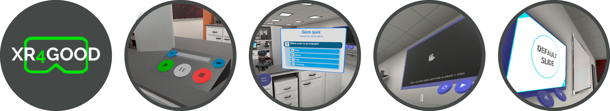
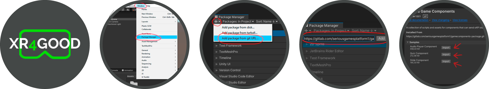

# Serious Game Components

## Overview
This project focuses in creating different didatic components that can help the user to create a compact yet diverse classroom environment in Unity Engine. 

It uses [xAPI](https://xapi.com/overview/) in order to track all of the player's activities towards the components per se, building different statements according to the way in which the player interacts with these objects, and then sending them to a LRS specified by the user.

Currently, there are three different components available, with those being:

#### Audio Player

- A component that can store a list of audio files and play them according to the order of the list. It tracks how much time the player listened to a specific audio, as well if the player listened every entry.

#### Quiz
- Stores a set of questions and answers. The amount of answers can be specified by the user, as well as the amount of correct ones. It tracks how much time the player stayed in one question, if the player has answered correctly or not as well if the player has answered every entry.

#### Slides
- A component that stores a list of images that can represent anything, such as pages of a slideshow. It tracks how much time the player stayed in one page, and if the player has seen all entries.

#### LRS Information
- A very simple component that makes the LRS credentials generalized for all the components to use, instead of defining them in each component separately. 
- Note that only one LRS Information script is allowed in a scene, any duplicates **will** be destroyed when the game starts.

#### LMS Loader
- A component that manages the other components communication with the XR4Good LMS, authenticating and downloading a specified lesson data for the components to load. 
- A LMS Loader doesn't necessarily need to exist in the same scene as the other components for the information downloaded to be used, as long as said information has already been downloaded. 
- Note also that only one LMS Loader script is allowed in a scene, any duplicates **will** be destroyed when the game starts.

## Installation

 - To open and load the package on Unity, you must have [Git](https://git-scm.com/downloads) installed and configured in your computer.

 - Go to the Window tab and open the **Package Manager**

 - Click on the plus (+) button and then select **Add package from git URL**

 - Enter this repository clone URL and click on the **Add** button

 - Wait for the package to download and install in your project
 
 - After this, you can open the **Samples** foldout and import any assets of the already developed components for an already mounted prefab

## Usage
After installation, the usage is very simple. You can either use the developed prefabs available in the Samples section, or you can create your own object using the package's scripts.

To use the components, just drag the prefabs into the desired scene and manage the settings in the Unity Inspector for each specific component. The default settings are to load the LMS downloaded data from the LMS Loader automatically.

## Supporting Videos

- [Installation and Deploy - Part 1](https://youtu.be/RUUmode2vJI)

- [Installation and Deploy - Part 2](https://youtu.be/CnGQR6OX7aQ)

## Supporting Documents

- [PIMENTA, André Schneider Guimarães Montresor. Uma arquitetura de modularização de componentes para desenvolvimento de jogos sérios na Unity Engine. 2022. 39 f. Monografia (Graduação em Ciência da Computação) - Instituto de Ciências Exatas e Biológicas, Universidade Federal de Ouro Preto, Ouro Preto, 2022.](http://www.monografias.ufop.br/handle/35400000/4710)

## Readme in other languages

 - [Português (PT-BR)](/doc/README.pt.md)
